Snakefiles details
==================

This workflow comprises 7 Snakefiles to execute in the prescribed order:
    * 00_download_references.smk
    * 01_quality_check.smk
    * 02_clean_data.smk
    * 03_mapping.smk
    * 04_counts.smk
    * 05_stats.smk
    * 06_enrichment.smk

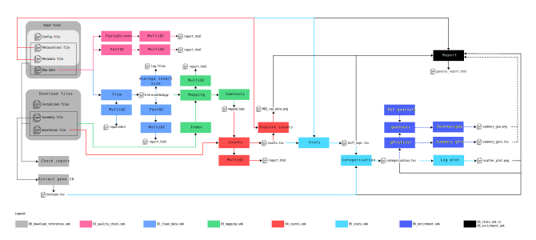

    Illustration of the different steps in the workflow, each color represents one snakefile steps. Round-edged rectangles contain the list of required elements for the workflow. Rectangles represent Snakemake rules. Dashed lines represent conditional links, these rules are executed according to conditions defined by the users in the configuration file.

For all Snakefiles, the rule **all** always takes in input the end files needed by the Snakefile to construct the DAG hierarchy before running.

These snakfiles use various conda environments available in the *envs* folder, as YAML files.

.. note::
    Environments created by Snakemake can be re-used if they were created through the ``--use-conda`` option and if the YAML file was not modified.

Snakefile download_references.smk
---------------------------------

This initial step involves importing references files from various databases and verifying input files.

It consists of 8 rules:

    #. rule **all**
    #. rule **FastqScreen_download**
    #. rule **DLrefAssembly**
    #. rule **DLrefAnnotation**
    #. rule **unzipREF**
    #. rule **Check_inputs**
    #. rule **ExtractGeneID**
    #. rule **Biotype**

This Snakefile uses 3 conda environments:

    * envs/pre-alignment/fastqscreen.yml (rule FastqScreen_download)
    * envs/pre-alignment/pigz.yml (rule unzipREF)
    * envs/stats/pandas.yml (rules Check_inputs, ExtractGeneID and Biotype)

These environments allow the installation of FastQC, FastqScreen, MultiQC, and some python packages.

Description of the rules
~~~~~~~~~~~~~~~~~~~~~~~~
FastqScreen is a tool used to detect read contamination, the first rule consists to download the genomes reference files from its database.

The DLrefAssembly and DLrefAnnotation rules call upon the Ensembl API to download genome or transcriptome and annotation reference files. To carry out this step, the user must provide the name of the organism and its taxonomic code in the configuration file.

Subsequently, the downloaded reference files are unzipped to enable the rest of the workflow. Typically, this process requires approximately 5G of free space.

The final three steps involve preparing files for the workflow by checking metadata, metacontrast, raw data input files, and downloaded reference files for use. We simply verify that the raw data files are not empty and are well formatted. The user should verify the md5sum or sha256 keys of their raw data prior to executing the workflow. The ExtractGeneID rule extracts the gene ID into a file for the Biotype rule, which retrieves the information linked to the gene ID from the NCBI gene info database. This information is necessary in the final steps of the workflow.

Execution
~~~~~~~~~
Once the configuration file, metadata file and metacontrast file have been filled in, the first step can be executed. Make sure you are on a machine with an internet connection to perform this step.

Activate your Snakemake environment with the following command, replacing the [name_snakemake_env] with the name of the snakemake environment you have defined:

.. code-block:: bash

   conda activate [name_snakemake_env]

And run the following command, replace *config_[SE/PE].yml* by your configuration file (you can add snakemake options to suit your needs):

.. code-block:: bash

   snakemake -s translatome/workflows/00_download_references.smk --use-conda --conda-frontend mamba --configfile config_[SE/PE].yml -j 1 -n

Check outputs
~~~~~~~~~~~~~
To ensure that the downloaded and input files format are correct at the end of running the snakefile *00_download_references.smk*, check the following .done and .log files:

* *download_annotation.done*: must be empty.
* *download_assembly.done*: must be empty.
* *unzip.done*: must be empty.
* *download_genomes_fastqscreen.done*: must contain request messages for downloading FastqScreen files, everything must be "OK".
* *{organism}.done*: should contain previews of the *list_id_gene_biotype.tsv* file.
* *check_input_files.log*: must not contain any error messages.

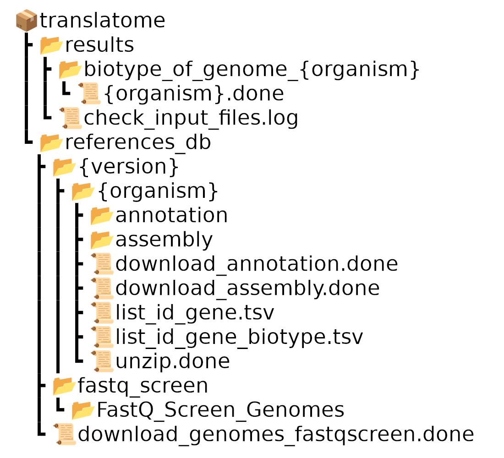

    Tree structure of output files from the download references stage

.. Note::
    After downloading the references, add the names of the annotation and assembly files to the configuration file using the "assembly_ref" and "annotation" options. As the file names are not known in advance, it is necessary to add them to the configuration file. 

Snakefile quality_check.smk
---------------------------

This step involves assessing the initial quality of fastq files.

It comprises 5 rules:

    #. rule **all**
    #. rule **FastQC**
    #. rule **MultiQC**
    #. rule **FastqScreen_mapping**
    #. rule **MultiQC_fqscreen**

This Snakefile uses different conda environment:

    * envs/pre-alignment/fastqc.yml
    * envs/pre-alignment/multiqc.yml
    * envs/pre-alignment/fastqscreen.yml

Description of the rules
~~~~~~~~~~~~~~~~~~~~~~~~
FastQC is a tool for checking data quality. Further information regarding its functionality can be found at: https://www.bioinformatics.babraham.ac.uk/projects/fastqc/

MultiQC is an aggregator of files in order to obtain a single report. Different modules are available, the list is available at: https://multiqc.info/modules/

FastqScreen is used to align raw data with genome reference files to check for contamination by other organisms. The reports it generates are then concatenated by MultiQC in the final rule of this Snakefile.

Execution
~~~~~~~~~
If no errors appear using the dry-run mode, then run the following command to perform the quality check:

.. code-block:: bash

    snakemake -s translatome/workflows/01_quality_check.smk --use-conda --conda-frontend mamba --configfile config_[SE/PE].yml -j 1 -n

Check outputs
~~~~~~~~~~~~~
To ensure that quality control has been carried out correctly, check the following files:

* *fastq_screnn.done*: displays execution messages for fastqscreen, processing must be complete by the end of the file.
* *FQC.done*: displays FastQC execution messages.
* *MQC_fastqc.done*: displays MultiQC execution messages, must not contain errors and must display "[Info] MultiQC complete".
* *MQC_fastqscreen.done*: displays MultiQC execution messages, must not contain errors and must display "[Info] MultiQC complete".

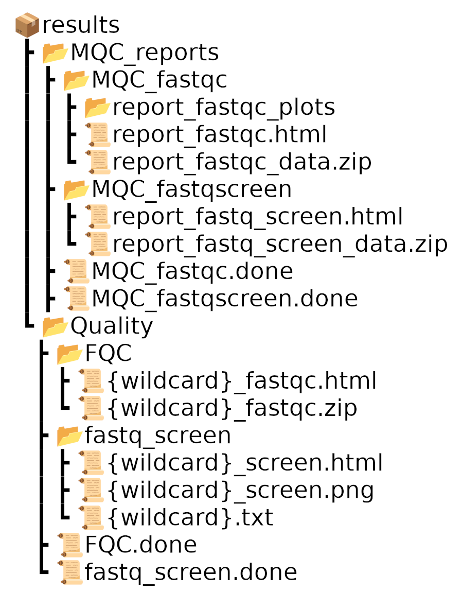

    Tree structure of output files from the quality stage

Snakefile clean_data.smk
------------------------

This Snakefile concerns the quality filtering of raw data according the previous results.
The user has to check the elements to filter and modify accordingly the configuration file before running this Snakefile.

This snakfile has two modes depending on the chosen trimming tool.
The user has to give the name of the wanted tool in the configuration file.

Choice 1:

    #. rule **all**
    #. rule **Cutadapt**
    #. rule **MultiQC_cutadapt**
    #. rule **AverageInsertSize**
    #. rule **FastQC_after_trim**
    #. rule **MultiQC_after_trim**

Choice 2:

    #. rule **all**
    #. rule **Fastp**
    #. rule **MultiQC_Fastp**
    #. rule **FastQC_after_trim**
    #. rule **MultiQC_after_trim**

This Snakefile uses different conda environment:

    * envs/pre-alignment/fastqc.yml
    * envs/pre-alignment/multiqc.yml
    * envs/pre-alignment/cutadapt.yml
    * envs/pre-alignment/bbmap.yml (rule AverageInsertSize)
    * envs/pre-alignment/fastp.yml

Description of the rules
~~~~~~~~~~~~~~~~~~~~~~~~
Cutadapt and Fastp trimming tools differed in their algorithm. The final choice is given to the user, we consider these tools as equivalent in performance, except in running time. 

In contrast with Fastp, Cutadapt does not calculate the average insert size when data are paired-end, so we have added a step using a bbmap tool.

Execution
~~~~~~~~~
Run the following command (no internet connection required):

.. code-block:: bash

    snakemake -s translatome/workflows/02_clean_data.smk --use-conda --conda-frontend mamba --configfile config_[SE/PE].yml -j 1 -n

Check outputs
~~~~~~~~~~~~~
FastqScreen and FastQC quality control results are available in the FastqScreen and FastQC MultiQC reports. It is essential to review these reports in order to determine trim options (adapter cut-off, sequence length, sequence quality, etc.) and to check data integrity (data contamination, GC percentage, etc.). Set the trim options for fastp or cutadatap and specify the length of the read after trim ("rlength" option) in the configuration file. 

To ensure that trimming has been carried out correctly, check the following files :

* *FQC2_trim_{tool}.done*: displays FastQC execution messages. 
* *{wildcard}_trim.done*: display trimming information and command
* *MQC_fastqc2_trim_{tool}.done*: displays MultiQC execution messages, must not contain errors and must display "[Info] MultiQC complete".
* *MQC_trim_{tool}.done*: displays MultiQC execution messages, must not contain errors and must display "[Info] MultiQC complete".

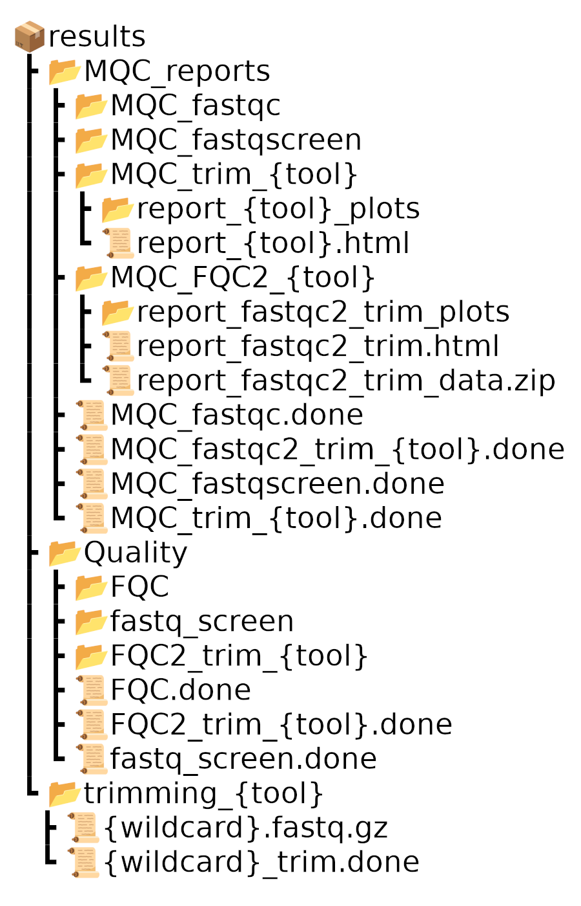

    Tree structure of output files from the trimming stage

Also check the quality of the data after trimming by looking at the MultiQC reports *report_{tool}.html* and *report_fastqc2_trim.html*.

Snakefile mapping.smk
---------------------

This step concerns the alignment of fastq files onto reference files that were previously downloaded.

It is composed of 6 rules:

    #. rule **all**
    #. rule **IndexSTAR**
    #. rule **STAR_alignment**
    #. rule **Sort_bam**
    #. rule **Samtools_index**
    #. rule **MultiQC_STAR**

This Snakefile uses different conda environment:

    * envs/pre-alignment/multiqc.yml
    * envs/aligner/star.yml
    * envs/post-alignment/samtools.yml

Description of the rules
~~~~~~~~~~~~~~~~~~~~~~~~
STAR is a universal RNA-seq aligner. We use it to index the genome and annotation files that were previsouly downloaded in step 00, and then to map the quality-filtered reads to this index.
STAR requires the length of the quality-filtered reads less one to define the size of sequence to index. The user has to provide it in the configuration file.
The alignments in .sam format are automatically convert into .bam using samtools, through the pipe of the STAR_alignment and Samtools_view rules. BAM files are binary and take up less disk space, but are unreadable when opened.
Then, BAM files are sorted and indexed for the following Snakefile.

MultiQC is also used to concatenate the STAR reports into a single one.

Execution
~~~~~~~~~
If you are satisfied with the data quality after trimming, use the command:

.. code-block:: bash

    snakemake -s translatome/workflows/03_mapping.smk --use-conda --conda-frontend mamba --configfile config_[SE/PE].yml -j 1 -n

Check outputs
~~~~~~~~~~~~~
To ensure that mapping has been carried out correctly, check the following files :

* *{wildcard}.done*: display message "finished successfully"
* *{wildcard}Log.final.out*: display the percentage of mapping and other information about the mapping. 
* *MQC_star.done*: displays MultiQC execution messages, must not contain errors and must display "[Info] MultiQC complete".

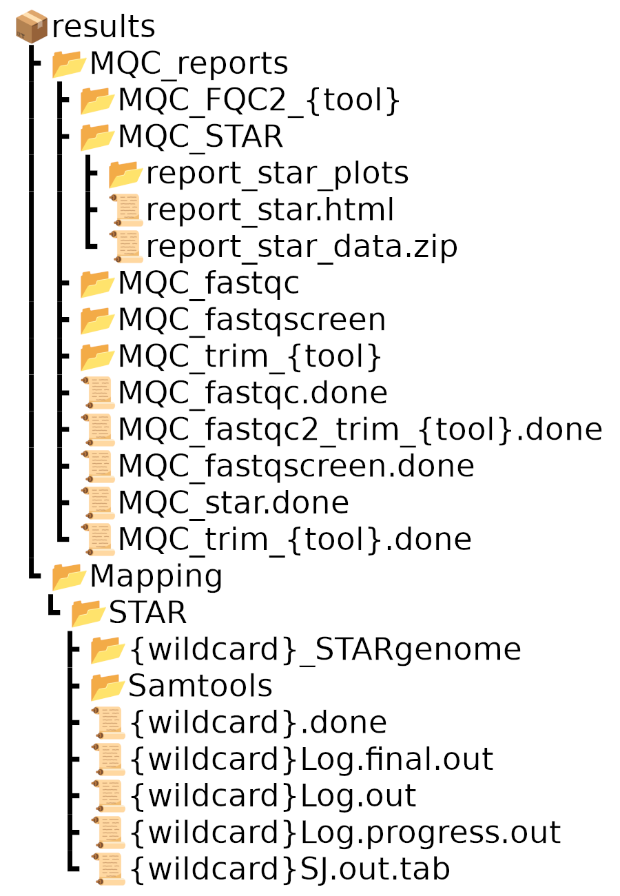

    Tree structure of output files from the mapping stage

If you want to see the general mapping statistics, have a look at the *report_star.html* file. The *{wildcard}Log.final.out* file allows you to have a detailed look at the mapping percentages (uniquely mapped reads, read length, multimapping percentages, unmapped reads, chimerism rate).

Snakefile counts.smk
--------------------

This step concerns the counting of mapped reads.

This snakfile behaves in two ways depending on the selected counting too
The desired tool must be specified in the configuration file by the user.

Choice 1:

    #. rule **all**
    #. rule **FeatureCounts**
    #. rule **MultiQC_FeatureCounts**
    #. rule **MergeFeatureCounts**
    #. rule **MDS_on_raw_data**

Choice 2:

    #. rule **all**
    #. rule **HTSEQ**
    #. rule **MultiQC_HTSeq**
    #. rule **MergeHTSeqcounts**
    #. rule **MDS_on_raw_data**

This Snakefile uses different conda environment:

    * envs/pre-alignment/multiqc.yml
    * envs/post-alignment/subread.yml (rule FeatureCounts)
    * envs/stats/pandas.yml (rule Merge*Counts)
    * envs/post-alignment/htseq.yml
    * envs/stats/limma.yml (rule MDS_on_raw_data)

Description of the rules
~~~~~~~~~~~~~~~~~~~~~~~~
FeatureCounts and HTSEQ-counts differed in their algorithm on paired-end data counting. The user can select the tool of his choice or combine the resulting counts of both tools. If you do this, please respect the required architecture for the next Snakefile.

Counts are performed by samples and then merged into one single file before plotting their dispersion using a multi-dimensional scaling plot (MDS, similar to a PCA) without a priori. 

At least 3 replicates are necessary for the creation of an MDS plot. The workflow will terminate if this requirement is not met. The user must specify the number of replicates in the configuration file.

Execution
~~~~~~~~~
Run the following command to count the reads:

.. code-block:: bash

    snakemake -s translatome/workflows/04_counts.smk --use-conda --conda-frontend mamba --configfile config_[SE/PE].yml -j 1 -n

Check outputs
~~~~~~~~~~~~~
To ensure that count has been carried out correctly, check the following files:

* *MQC_{tool_count}.done*: displays MultiQC execution messages, must not contain errors and must display "[Info] MultiQC complete".
* *{wildcard}.log*: for HTSeq Count, the message we need to get is "processed alignments".  Note that unlike Feature Counts, HTSeq Count does not give information about the percentage of reads assigned. For Feature Counts, we can to find the assignment percentage and the type of data processed (pair-end or single-end). 

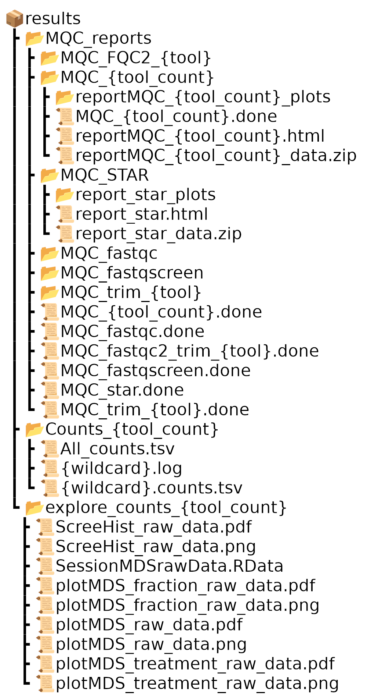

    Tree structure of output files from the count stage

Using the MultiQC report in the count tool, check the percentage of genes assigned and other information provided by MultiQC. The percentage of assigned genes should be high.

Then use the *plotMDS_raw_data.png* file to determine the statistical method best suited to the data (option: "deseq2" or "limma"). If the samples show a batch effect, use the 'limma' option in the configuration file, otherwise use "deseq2". If deseq2 is selected, be sure to also select the filtering method (available options: edger, deseq (counts > 10) or default (counts > 1)).

Examples of MDS plot with Deseq2 or limma:

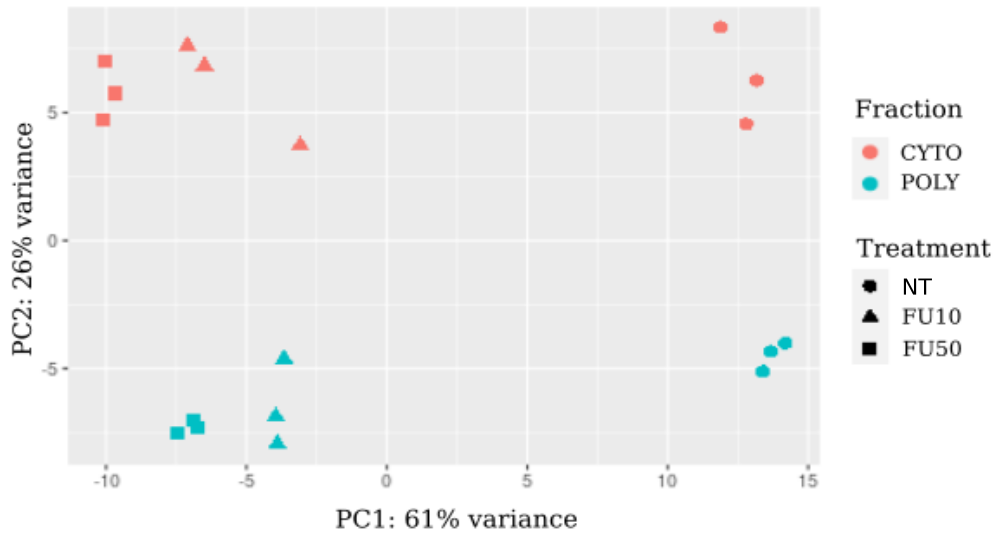

    No batch effect on this MDS plot, recommended tool Deseq2

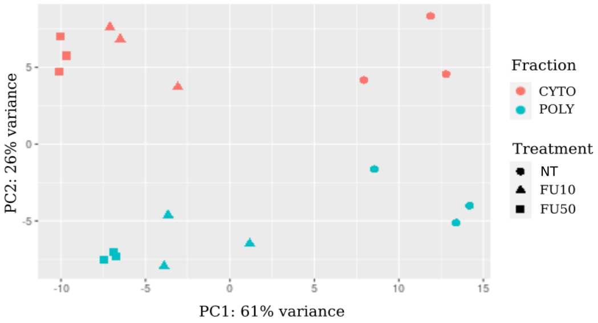

    Batch effect on this MDS plot, recommended tool limma

Snakefile stats.smk
-------------------

This step concerns the statistical analysis of the count file.
The Snakefile requires at least 3 replicates to be run. The workflow abort if this condition is not respected. 
The number of replicates required must be provided by the user in the configuration file.

This Snakefile exhibits four behaviours dependent on the selection of the statistical tool.
The user must indicate the name of the desired tool in the configuration file.

Choice 1:

    #. rule **all**
    #. rule **Diff_gene_expression_deseq2**
    #. rule **Categorization**
    #. rule **logPLot**
    #. rule **clean**
    #. rule **general_report**

Choice 2:

    #. rule **all**
    #. rule **Diff_gene_expression_deseq2**
    #. rule **Categorization**
    #. rule **logPLot**

Choice 3:

    #. rule **all**
    #. rule **Diff_gene_expression_limma**
    #. rule **Categorization**
    #. rule **logPLot**
    #. rule **clean**
    #. rule **general_report**

Choice 4:

    #. rule **all**
    #. rule **Diff_gene_expression_limma**
    #. rule **Categorization**
    #. rule **logPLot**

This Snakefile uses different conda environment:

    * envs/stats/deseq2.yml
    * envs/stats/limma.yml
    * envs/stats/pandas.yml (rule Categorization)
    * envs/stats/ggplot2.yml
    * envs/stats/rmarkdown.yml (rule general_report)

Description of the rules
~~~~~~~~~~~~~~~~~~~~~~~~
DESeq2 and limma-voom are both options for statistical analysis.
However, we suggest using Limma-Voom solely in instances of bias between replicates, if observed from the MDS plot.

Differentially expressed genes are classified based on directional changes, whether up or down, and translation or transcription.
The tendancy can be visualized with the results of the logPLot rule.

If no enrichment is specified in the configuration file, the final report is produced and unwanted files are cleaned up.

Execution
~~~~~~~~~
Once the counts have been made and the statistical method selected in the configuration file, run the statistics section with the following command:

.. code-block:: bash

    snakemake -s translatome/workflows/05_stats.smk --use-conda --conda-frontend mamba --configfile config_[SE/PE].yml -j 1 -n

Check outputs
~~~~~~~~~~~~~
To ensure that stats has been carried out correctly, check the following files:

* *explore_results.log* : must not contain any errors.
* *{tool_stat}.log* : must not contain any errors and the contrasts must be displayed in the order requested.
* *logplots.log* : must not contain any errors and the contrasts must be displayed in the order requested.

Tree structure for DESeq2 output :

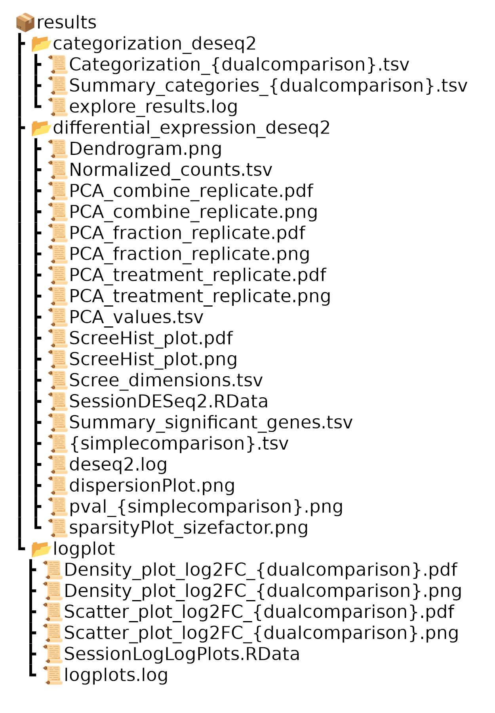

    Tree structure of output files from the statistical stage with DESeq2

Tree structure for limma output :

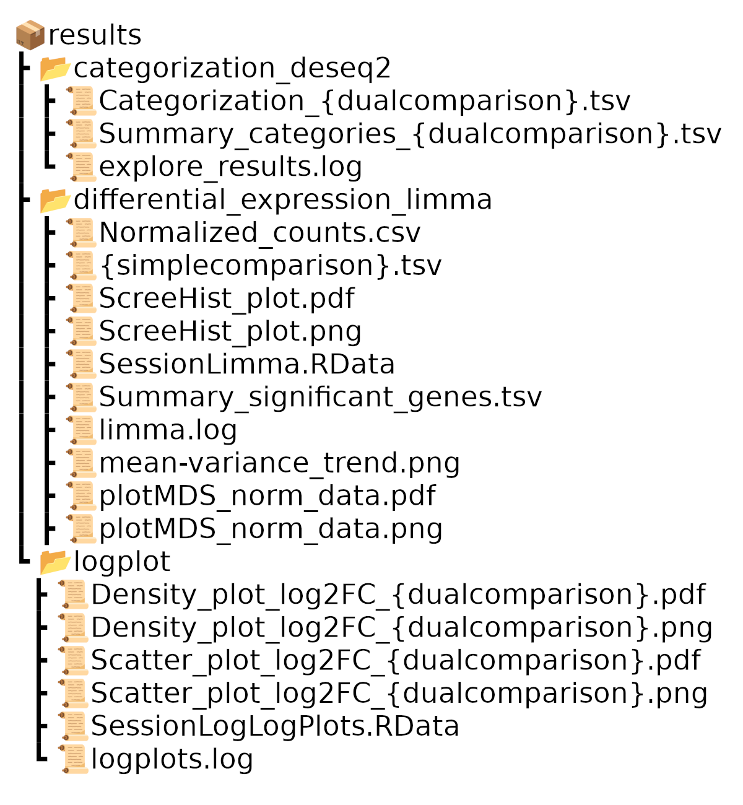

    Tree structure of output files from the stat stage with limma

Snakefile enrichment.smk
------------------------

This step pertains to the gene set enrichment analysis of the identified differentially expressed genes. 
To be executed, the configuration file option for enrichment should be set to 'gprofiler' and not 'None'.

It is composed of 8 rules:

    #. rule **all**
    #. rule **gprofiler**
    #. rule **enrichment_summary_gprofiler**
    #. rule **ref_goatools**
    #. rule **goatools**
    #. rule **enrichment_summary_goatools**
    #. rule **general_report**
    #. rule **clean**

This Snakefile uses different conda environment:

    * envs/stats/gprofiler.yml
    * envs/stats/ggplot2.yml
    * envs/stats/goatools.yml
    * envs/stats/rmarkdown.yml

Description of the rules
~~~~~~~~~~~~~~~~~~~~~~~~
The gProfiler API is used to enrich the differentially expressed genes with gene ontology, pathway and corum complex databases.

The gene ontology results are then classified by level and depth using goatools.

After that, the ultimate report is generated and any unwanted files are removed.

Execution
~~~~~~~~~
If the "enrichment" option in the configuration file is set to "gprofiler", then run the following command line (internet connection required):

.. code-block:: bash

    snakemake -s translatome/workflows/06_enrichment.smk --use-conda --conda-frontend mamba --configfile config_[SE/PE].yml -j 1 -n

Check outputs
~~~~~~~~~~~~~
To ensure that enrichment has been carried out correctly, check the following files :

* *gpro.log* : must not contain any errors
* *goatools_summary.log* : must not contain any errors
* *gprofiler_summary.log* : must not contain any errors

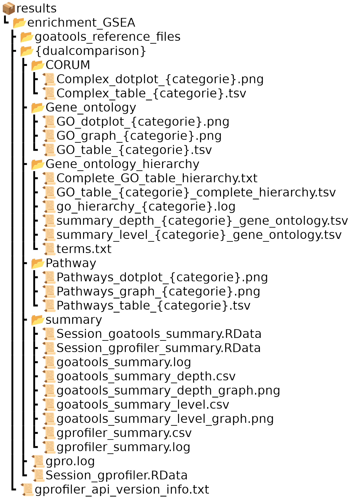

    Tree structure of output files from the enrichment stage

It is possible not to obtain enrichment results for certain categories. At the end of this stage, the *{name_report}.html* report will be available, combining the results of the statistical and enrichment sections.

If the gprofiler option is activated in the configuration, an enrichment section will be displayed with the results of gProfiler2 and goatools. gProfiler performs a functional enrichment analysis on a list of significant input genes. It compares the genes with known sources of functional information and detects statistically significant enriched terms. The statistical domain size N describes the total number of genes used for random selection and is one of the four parameters of the hypergeometric probability function of statistical significance used in gProfiler. Here, we use genes from the reference genome. A summary table is available showing the number of terms per source for gProfiler for each double comparison.

Using goatools, we propose to provide the hierarchy of GO terms (BP, CC and MF) highlighted by gProfiler2 for each double comparison and each category. The histograms illustrate the number of terms present at each depth of the hierarchy (for BP, MF and CC) for each category for a given comparison. The same type of histogram has been created for levels and is available in the *enrichment_GSEA/comparison/summary/* folder.

General Report
~~~~~~~~~~~~~~
At the end of the 06_enrichment.smk, or 05_stats.smk if the "enrichment" option in the configuration file is set to "None", a general report is made. 

This report contains several parts:
    #. The analysis context, which is defined by the user in the pipeline configuration
    #. The MDS plot of the raw data from the count table provided at the output of the snakefile *04_counts.smk*
    #. The statistical method chosen (limma-voom or DESeq2) with the design
    #. The user's contrasts displayed in the form of a diagram. Single comparisons for translation and transcription on one side and double comparisons on the other.
    #. Depending on the choice between limma-voom and DESeq2, the user will also find plots showing the distribution of the standardised samples
    #. The histogram of biotype showing the types of genes (protein, RNA, pseudogene, etc.) present in the experimental data and also in the selected reference genome
    #. Summary of significant genes for each single comparison
    #. Summary of significant genes for the double comparison with log-log plots, where genes are plotted against their log2FC in translation and transcription and categorized (TRAD_UP, TRAD_DOWN, TRANS_UP, TRANS_DOWN, BOTH_UP, BOTH_DOWN, DIVERGENT_DNUP, DIVERGENT_UPDN, BACKGROUND)

This final report can be found:

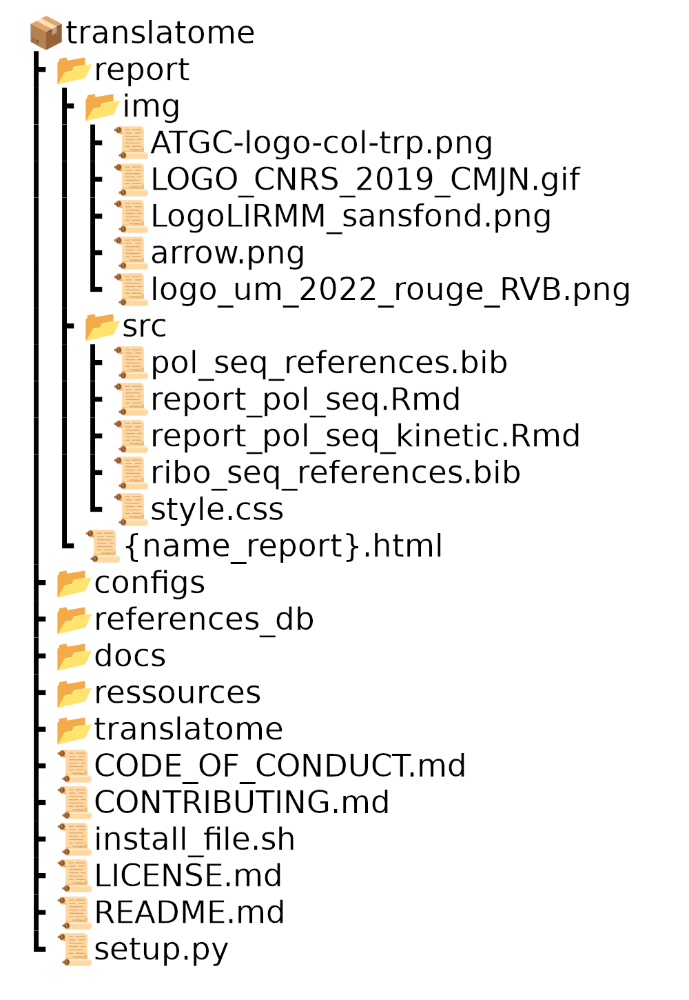

    Tree structure of output report

.. Note::
    The Ensembl identifiers of the reference genome were extracted (and saved as required in the *list_id_gene.tsv* file in the *reference_db/release/organism/* folder) and entered into the biodbnet database to establish their genomic type. This information was recorded in the *list_id_gene_biotype.tsv* file in the *reference_db/release/organism/* folder. To obtain the genomic biotypes of the experimental data, an intersection was made between the Ensembl identifiers of the experimental data and the *list_id_gene_biotype.tsv* file.
