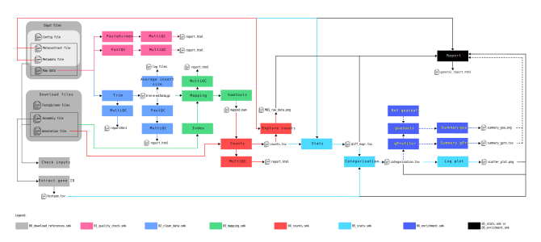

Translatome Regulations Analysis In a Nutshell (TRAIN)
======================================================
A workflow to analyze jointly transcriptome (RNA-seq) and translatome (POL-seq) data to study the translational efficiency.

    Figure: Complete diagram of the TRAIN workflow

Please use the following information to cite the package and the overall approach.

.. code-block::
    Ripoll J., Mandier C., Chen F., Rivals E. (2024). The Translatome Regulations Analysis In a Nutshell (TRAIN) workflow: joint transcriptome and translatome categorization. GitHub, https://github.com/Translatome/TRAIN.

    Ripoll J., et al (unpub). future article (DOI)

Overview
--------
The Translatome Regulations Analysis In a Nutshell (TRAIN) project consists in an Snakemake workflow to study the translational efficiency by comparing two different fractions of mRNA NGS sequencing.

This workflow has different configuration modes:
    * classic: comparison of two conditions e.g. control vs. treatment
    * kinetic: additional time factor

It uses Conda environments to facilitate its re-usability, portability and maintain in the time.

The workflow performs quality check of fastq files, trimming, mapping, counting, differential expression and enrichment analyses. 
It can be applied to single-end or paired-end data.

.. Note::
    This workflow is provided as is, without guaranty if any modification is made.

Inputs/Ouputs
-------------
The typical inputs are for instance:
    * fastq files of RNA-seq sequencing from cytoplasmic or total fraction
    * fastq files of POL-seq sequencing from heavy or ligth fraction
    * a metadata file with the information about samples, replicates and treatments (example available in the `documentation <https://translatome.github.io/TRAIN/metafiles.html#metadata>`_)
    * a metacontrast file with the wanted comparisons (example available in the `documentation <https://translatome.github.io/TRAIN/metafiles.html#metacontrast>`_)
    * a configuration file in YAML format for Snakemake (example available in the `github <https://github.com/Translatome/TRAIN/blob/main/configs/config_PE.yml>`_)

The main outputs are:
    * 3 graphics: a Principal Component Analysis (PCA) of the normalized counted reads, the translational status of genes using transcription and translation log2-fold changes and the depth of the gene ontology terms highlighted with the translational status colors used in the logplot
    * 3 table: the differential expression for each comparison provided in the metacontrast file, the results of the translational status for all genes, and the results of the enrichment.

    Figure: Main inputs and outputs of the TRAIN workflow

Requirements
------------
    * Minimal configuration: 3 biological replicates
    * Minimal configuration: 2 conditions to compare (e.g. a control vs. a treatment or two treatments)
    * The transcriptome and translatome should be sequenced with the same technology on a same pool to avoid technical biais.
    * Python version >= 3.10
    * Snakemake version >= 7.14.0
    * Conda and/or Mamba
    * Download from distant databases for snakefiles 00 and 06

Advantages
----------
    * Help to respect FAIR principles
    * Easy installation of programs (Conda)
    * Easy to use and automatized (Snakemake)
    * Modularized through the use of wrappers
    * Easy to maintain as workflows are described via a human readable Python-based language
    * Management of unwated crash, redo only the missing part
    * Handle parallelization and efficiently use any computing platform
    * Reproducibility of analysis by freezing program and databases version
    * Flexible, different tools for a same step in the workflow
    * Management of paired-end or single-end data
    * Management of kinetic data
    * Simplified configuration
    * Gene ontology analysis and enrichment

License
-------
`LICENSE <https://github.com/Translatome/Translatome/blob/master/LICENSE.md>`_ terms are in agreement with CeCILL License.
See: `http://www.cecill.info/licences.fr.html <http://www.cecill.info/licences.fr.html>`_

Contributions
-------------
See the `contributing <https://github.com/Translatome/TRAIN/blob/main/CONTRIBUTING.md>`_ file and please follows the recommandation in the `code of conduct <https://github.com/Translatome/TRAIN/blob/main/CODE_OF_CONDUCT.md>`_

Cited in
--------
    * JOBIM 2023:
        Ripoll J., Mandier C., Chen F., Rivals E. 2023. Joint transcriptome and translatome analysis: a reproducible pipeline. JOBIM 2023, Nice, France (June 27-30). `DOI <https://jobim2023.sciencesconf.org/data/pages/proceedings.pdf>`_
    * Nature Communication 2022:
        Therizols G., Bash-Imam Z., Panthu B., Machon C., Vincent A., Ripoll J., et al. 2022. Alteration of ribosome function upon 5-fluorouracil treatment favors cancer cell drug-tolerance. Nature Communications 13, 173. `DOI <https://doi.org/10.1038/s41467-021-27847-8>`_
    * Genotoul Biostat Bioinfo days 2022:
        Ripoll J., Chen F., Mandier C., Rivals E. 2022. Joint Transcriptome and Translatome Analysis: A Reproducible Pipeline and an Example in Cancer Research. Genotoul Biostat Bioinfo days. INRAE, Auzeville, France (30 Nov. 2022). `DOI <https://bioinfo-biostat.sciencesconf.org/data/pages/genotoul_ripoll_2022.pdf>`_
